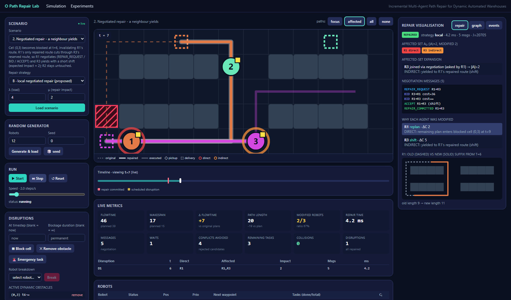

# Incremental Multi-Agent Path Repair for Dynamic Warehouses

A working simulation of robots in an automated warehouse. Robots get collision-free plans from prioritized
**Space-Time A\***. While they move, things go wrong:

1. a grid cell is **blocked**,
2. a robot **breaks down**,
3. an **emergency task** arrives.

Instead of replanning everyone, the system **repairs only the plans that need it**: it finds the affected robots,
tries cheap fixes first (wait, shift, detour), lets neighbours **negotiate** when that is not enough, and leaves every
other plan untouched. Global replanning exists only as a baseline for comparison.



## Project layout

| Folder | Content |
|---|---|
| `backend/app/domain`, `planning`, `repair`, `simulation` | The engine (no UI dependency): grid, A\*, repair, simulator |
| `backend/app/api` | FastAPI REST + WebSocket server |
| `backend/app/experiments` | Batch runner, statistics, table generation |
| `backend/app/tests` | 75 pytest tests |
| `backend/experiment_outputs` | Results of the reported experiments (CSV / JSON) |
| `frontend/` | Next.js UI: live simulation and experiment dashboard |
| `docs/` | `architecture.md`, `algorithm.md`, `experiments.md`, per-disruption result tables |

## Quick start

Requires Python 3.11+ and Node.js 20+.

```bash
# 1. backend  (http://localhost:8000, API docs at /docs)
cd backend
python -m venv .venv && source .venv/bin/activate     # Windows: .venv\Scripts\activate
pip install -r requirements.txt
python -m uvicorn app.main:app --port 8000

# 2. frontend (new terminal, http://localhost:3000)
cd frontend
npm install
npm run dev
```

The frontend expects the backend at `http://localhost:8000` (change with `NEXT_PUBLIC_API_URL`).
If a port is already in use, a server is probably still running; stop it or reuse it.

## Using the app

Open <http://localhost:3000/simulation>, choose a scenario, click **Load scenario**, then **Start** (or **Step**).

| # | Built-in scenario | What happens |
|---|---|---|
| 1 | Cell blockage | One robot detours; all other plans stay identical |
| 2 | Negotiated repair | A repaired route clashes with a neighbour, who yields after bidding |
| 3 | Robot breakdown | A robot stops in a one-wide aisle; its task is reassigned |
| 4 | Emergency task | A high-priority task makes a neighbour yield |
| 5 | Stress | 30 robots, 12 timed blockages and a breakdown |

You can also block cells, break a robot, add an emergency task, generate random scenarios, switch the repair
strategy (A / B / C) and scrub the timeline.

**Reading the picture:** dashed line = original plan, thick solid line = repaired part, faint line = already
travelled. Red ring = directly affected robot, orange ring = indirectly affected. The right panel shows the
affected set, negotiation messages, old-vs-new plans, the conflict graph and the event log.

Without the UI:

```bash
cd backend
python -m app.cli list
python -m app.cli run s2-negotiated-repair --strategy local --events
```

## How the repair works

1. **Plan**: prioritized Space-Time A\* reserves every robot's full path (cells and swaps).
2. **Detect**: a disruption invalidates the remaining plans of some robots, the *directly affected set*.
3. **Repair in order of cost**: wait, temporal shift, local detour, single-agent replan.
4. **Negotiate**: if that fails, the robots blocking the ideal route bid (Contract-Net style). The cheapest option wins.
5. **Expand** the affected set only if negotiation cannot resolve it, then replan that small group.
6. **Commit** only after all plans are validated against each other and all obstacles. Executed steps never change.

Breakdown tasks go to the robot with the lowest `distance + λ·load + μ·repair impact`. Emergency tasks are inserted into the
best robot's queue with a raised priority. Details and complexity: [docs/algorithm.md](docs/algorithm.md).

## Strategies compared

| | Strategy | Idea |
|---|---|---|
| A | Single-agent | Repair only the directly affected robots; no negotiation |
| B | **Local negotiated** (proposed) | Steps 1-6 above |
| C | Global replanning | Replan every active robot (baseline) |

## Experiments

Dashboard: <http://localhost:3000/experiments>. Or from the command line (parallel and deterministic):

```bash
cd backend
python -m app.experiments.batch_runner --type mixed --reps 20 --seed 0 --out experiment_outputs --name my_run
```

This writes `my_run.json`, `my_run_runs.csv` (one row per run) and `my_run_summary.csv` (mean, std, success rate).

The reported campaign has 6000 runs (4 disruption types × 5 team sizes × 5 obstacle densities × 20 seeds × 3 strategies).
Main findings (details in [docs/experiments.md](docs/experiments.md)):

* B succeeds as often as C (about 95 %) and far more often than A (about 86 %).
* B changes fewer robots than C (12.3 vs 14.6 per run on average) and is about 4× faster.
* B needs roughly 12 messages per run, C about 450.
* C finds somewhat shorter overall paths (B's flowtime is about 13 % higher).
* No collisions occurred in any run.

## Tests

```bash
cd backend && python -m pytest        # 75 tests
cd frontend && npx tsc --noEmit       # type check
```

## Limitations

* Prioritized planning is incomplete: some solvable cases are reported as failures, and a failed repair ends the run.
* Robots leave the grid after their last delivery; a robot that breaks down on someone's pickup or delivery cell makes
  that task unreachable.
* A blockage's duration is known when it is announced; robots carry one parcel; pickup and delivery are instantaneous.
* One interactive simulation per backend process; results come from a synthetic shelf-and-aisle map.

**Future work:** complete group repair (e.g. conflict-based search), parked robots, charging and service times,
multi-item capacity, learned negotiation weights, real warehouse traces.
